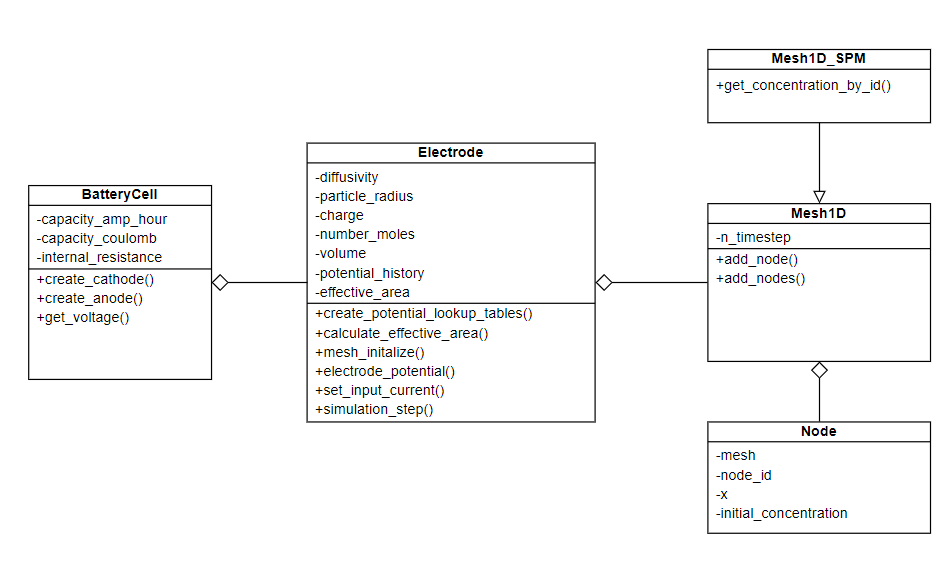

Design Process
==============

In this code suite, abstracting battery behavior was not a trivial task. 
LIBs can be designed with many different types of anodes and cathodes 
which directly affect the electro-chemical properties and electrolyte 
interactions. To capture this variability, we decided to create a 
dictionary of different lithium-ion battery types that each have 
their own unique properties regarding diffusivity, particle radius, 
and ion concentration. This increases the versatility of the code 
suite to make the simulations widely applicable should an end user 
decide to test through various types of lithium-ion batteries of 
their choosing. 

Finding a way to solve the first and second order derivatives of the 
SPM model was also not as simple as just plugging values into an 
equation. To remedy this, we decided to use a finite element method 
that involves using a mesh that is composed of nodes, which was 
necessary to analytically solve these governing equations. 

The SPM model was used to simulate battery cycling behaviors. For 
generating solutions a finite element method was chosen. Architectural 
choices were made to allow for future implementation of various different 
model types, though we had only implemented the finite element method.

Our initial design was less modularized than the final version, as many of 
the tests we created to verify integration results relied on hard coded 
constants and input parameters that could not be generalized at the conception. 
Once testing was complete for one case of hard coded constants, we were able to 
allow command line arguments to be passed into the program that allowed for 
flexibility of the simulation. For another example, the electrode.py class was 
very overloaded with a multitude of functions nested inside of it, but upon 
further inspection these functions could easily exist in a separate file that 
doesn’t need to be coupled with only the electrode class. 

UML DIAGRAM
-----------

   UML Diagram for libsim.